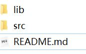
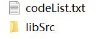

# L-Extractor

### Introduction

This part implements the deriving strategies to derive constraints from library code. We designed our own source code rules mining scheme based on *javaparser*(https://github.com/javaparser/javaparser), and also did some processing on the content of Javadoc to help to locate the rules .

The start function is

~~~java
public void anASt(String FILE_PATH, LibParam libParam) throws FileNotFoundException
~~~

which is the entrance to source code analysis.

Based on the VoidVisitorAdapter module of *javaparser*, we have rewritten the traversal method of different statements, and look for the rudimentary rules at the same time.

As stated in the paper, the rules can be divided into three categories: Exception, Condition, Order. After the source code analysis is completed, the tree types of rules output in order.

### Build
##### Requirements

- Windows, Linux or Mac OS
- Java 1.8

##### Preparation
- Create a folder named 'lib' in the directory of the 'src' folder, like this:

- Then create a list of the source code which need to be analyzed and store it a txt-file named 'codeList.txt', and put the corresponding source code files in the same folder, like this:

- Or you can change the path setting configuration in src/main/java/Main.java to change file reading methods.
##### Run

The start function is

~~~java
public static void main(String args[]) throws IOException
~~~

in src/main/java/Main.java. After the files are parsed, the rules result will be output to a csv file with a time-stamp. 

### Output
The output file includes the following columns:
- Id: rule number
- API Method: the specific function signature
- Library Name/Library Version/Class: The source file and version of the function
- Start Line/End Line: the source code location
- Type: rule classification, includes *exception*, *condition*, *order*
- Exception/Exception Condition: only rules of exception have this two columns
- Pre Order/Restrain Id: only rules of order have this column
- Condition:  only rules of condition have this column

