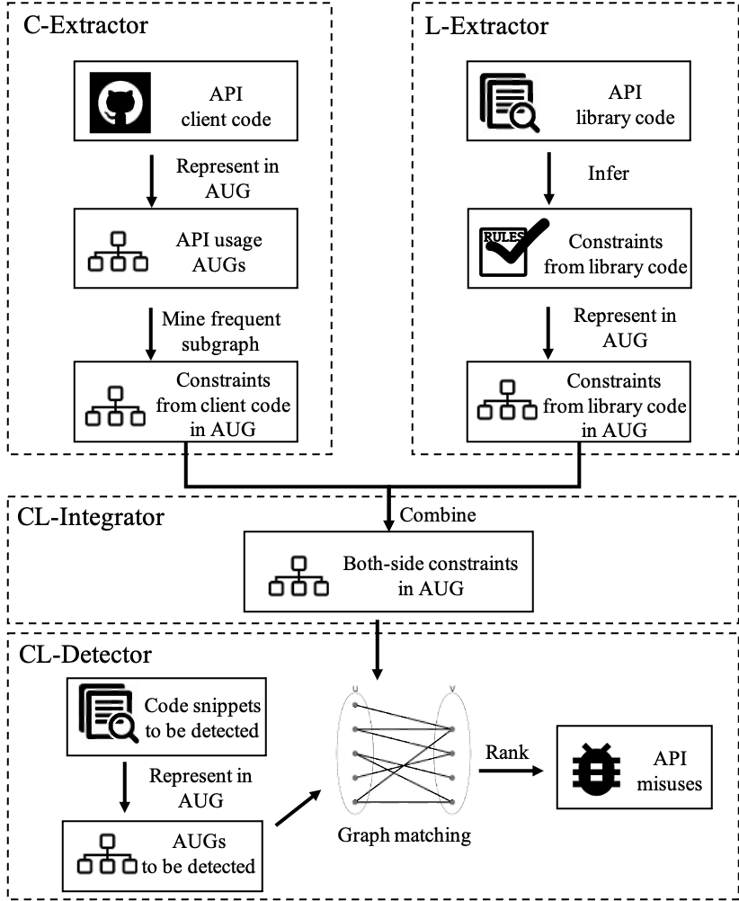

# APIMisuseDetector

An API misuse detector using API constraints mined from library code and client code.

## Introduction

We propose a bi-source approach that mines API constraints from both client and library to detect API misuses. The following figure presents an overview of our approach, which contains four main components:

1. C-Extractor mines constraints from client code. We extract API usage graphs (AUGs) and mine frequent usage patterns. 
2. L-Extractor analyzes the implementation of each API and infers various types of constraints such as conditions checking, call order and exception handling.
3. CL-Integrator combines the constraints from both sources.
4. CL-Detector uses both-side constraints to detect misuses such as missing call, missing condition checking, and missing exception handling.

## Dataset

- We evaluate the recall of our detector on the [MuBench](https://github.com/stg-tud/MUBench) dataset. After removing some projects without available urls, we collect 223 API misuse instances in [MuBench.csv](./dataset/MuBench.csv). 
- We mine API constraints of a target API set. Target APIs contains 106 Java APIs, including APIs involved in MuBench and 68 commonly used Java APIs that are most frequently discussed in Stack Overflow. Target APIs is available [here](./dataset/targetAPIs.xlsx).
- We adopt inferring strategies to infer constraints from library code. The inferred constraints from library code are available [here](./dataset/ConstraintsFromLibrary.csv).
- To mine constraints from client code, we collect top 20 client projects for each target API with the most API occurrences on GitHub through [Boa](http://boa.cs.iastate.edu/boa/index.php) tool. Mined client projects are available [here](./dataset/ClientProjectsByBoa.zip).

## CL-Detector

We apply several well-designed strategies to infer various constraints from library. And then, based on [MuDetect](https://github.com/stg-tud/MUDetect), a pattern-based API misuse detector, we mine constraints from client code, and combine them with constraints inferred from library code. Finally we detect API misuses using the above constraints.

More implementation details are available [here](./CL-Detector).

